# Qu'est-ce que WooCommerce ?

## Avant WooCommerce

WooCommerce est le système de e-commerce le plus populaire au monde à l'heure ou j'écris ces ligne, mais ce ne fut pas toujours le cas. Avant de commencer à vous guider au travers des différents chapitres de ce cours, je souhaiterais vous apporter quelques informations sur le système en lui même.

WooCommerce est en fait un fork d'un autre plugin de e-commerce appelé Jigoshop. En effet Jigoshop étant un project open-source, il est tout à faut possible de partir du code de base pour créer un plugin nouveau. Et c'est ainsi que deux développeurs, Mike Jolley et James Koster, tout deux travaillant pour la société JigoWatt on créé en Mai 2011 le plugin Jigoshop.

## De Jigoshop à WooCommerce

Le plugin Jigoshop fit un véritable carton lors de sa première année, si bien qu'une société Sud Africaine du nom de WooThemes proposa de racheter les droits d'utilisation de Jigoshop. Jigowatt refusa l'offre. Mais WooThemes ne s'arreta pas la: en effet, WooThemes débaucha Mike Jolley et James Koster et forka Jigoshop pour créer le projet WooCommerce.

Ayant perdu les deux créateurs du projet de leur plateforme ecommerce, Jigowatt continua de faire évoluer Jigoshop, mais à une vitesse moindre, puis en 2013 décida de se re-focaliser davantage sur son métier de base: le web design.

Pendant ce temps, le nombre de téléchargements de WooCommerce ne cessait d'augmenter, jusqu'a atteindre près de 20 millions de téléchargements (Janvier 2017). Le succès de WooCommerce fut tel que la société WooThemes fut, en 2015, achetée dans son intégralité par le Géant Automattic, la société éditrice de wordpress.org et wordpress.com. WooThemes possédait alors 50 employés, et ce rachat, le plus important jamais opéré par Automattic, fit grimper le nombre d'Automatticiens à près de 500.

En 2016 la société WooThemes devint WooCommerce, et c'est dorénavant plus de 100 personnes qui travaillent à temps plein sur le projet WooCommerce.

## Un projet Open-Source

WooCommerce est un plugin (une extension en bon Français) pour WordPress. Pour rappel, WordPress est un gestionnaire de contenu gratuit et Open source, tout comme WooCommerce. Et c'est là la grande puissance de cette combinaison: l'open-source.

En effet, l'intégralité du code est disponible à tous, ce qui rend donc la création de plugins compatibles WooCommerce très facile pour n'importe quel développeur. WooCommerce compte aujourd'hui plus de 400 plugins officiels sur woocommerce.com et plusieurs centaines sur wordpress.org, ainsi que sur des places de marché internationales telles que CodeCanyon. Il y a pour ainsi dire un plugin pour chaque utilisation.

Nous rentrerons dans le détails des certaines de ces extensions au fur et à mesure du déroulement de ce cours.

## Installer WooCommerce

### Pas de WooCommerce sans WordPress

WooCommerce est un plugin pour WordPress, ce qui veut dire que vous devez installer WordPress. WooCommerce ne peut se suffir à lui même.

Vous pouvez installer WooCommerce sur un site WordPress déjà existant ou sur une installation toute fraiche. Cela n'a que peu d'importance. Mais gardez en tête que étant donné qu'un plugin de ecommerce est un peu plus complexe que la plupart des autres plugins, cela requiert quelques étapes lors de l'installation.

### Avant de commencer

Vérifiez que vous possédez les droits nécessaire dans WordPress pour installer un nouveau plugin, si ce n'est pas le cas, vous devrez rentrer en contact avec l'administrateur du site. La façon la plus simple de procéder est de vérifier que votre role utilisateur est "administrateur".

### Lancer l'installation

Comme n'importe quel plugin WordPress, vous pouvez installer WooCommerce automatiquement depuis la page "Extensions" accessible depuis le menu correspondant dans le menu principal de l'administration WordPress.

1. Connectez-vous à votre administration WordPress (ajouter /wp-admin/ à la fin de l'URL de votre site)
2. Cliquez sur "Extensions"
3. Cliquez sur "Ajouter"
4. Dans le moteur de recherche tapez "WooCommerce"
5. Cliquez sur le bouton "Installer"
6. Dès que le plugin est installé, activez-le en cliquant sur le bouton "Activer".

Une fois le bouton cliqué, WooCommerce est installé et actif, c'est alors que, comme par magie, vous allez être guidé pour la configuration de WooCommerce au travers de différents écrans successifs. C'est ce que le appelle le Wizard, ou l'assistant de configuration, et c'est ce que nous allons voir au prochain chapitre.

## Une installation pas à pas

Après avoir cliquer sur le bouton "Activer" vous devriez vois l'écran ci-dessous. Il s'agit de l'écran de bienvenue de l'assistant de configuration.

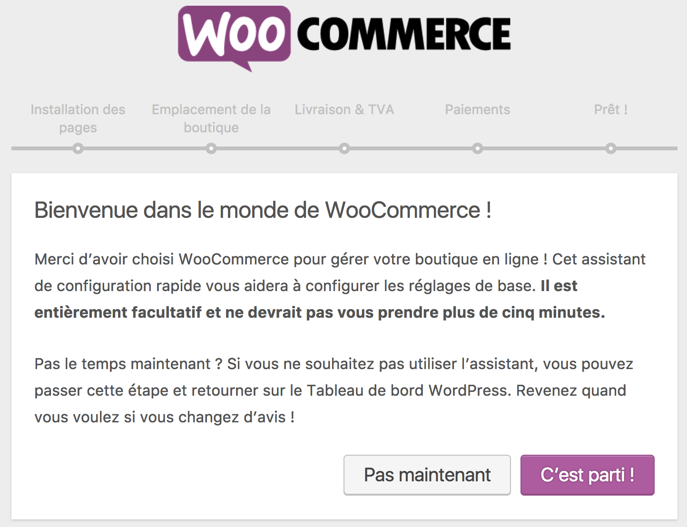

Vous pouvez relancer cet assistant à n'importe quel moment via l'URL suivant: http://votresite.com/wp-admin/admin.php?page=wc-setup

Cliquez sur le bouton "C'est parti" pour débuter la configuration de WooCommerce. Vous pouvez aussi cliquer sur le bouton "Pas maintenant" et effectuer la configuration de WooCommerce ultérieurement, mais cela serait vraiment dommage non ? :p

### Créer les pages WooCommerce

Pour fonctionner WooCommerce à besoin de créer plusieurs pages dans WordPress c'est précisément ce que propose la première étape de l'assistant de configuration:

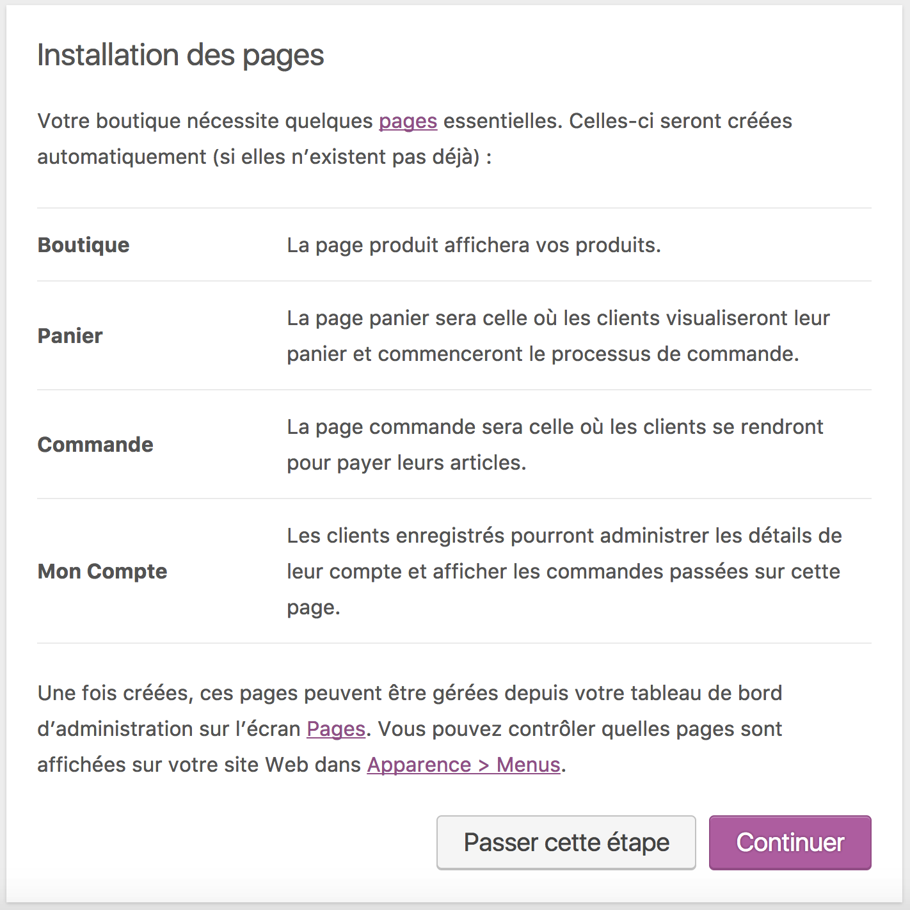

En cliquant sur le bouton "Continuer", toutes ces pages seront créées, et des shortcodes y seront ajoutés et vous accéderez à l'étape suivante.

### Définir l'emplacement de la boutique

Vous allez maintenant devoir renseigner les informations de localisation de votre boutique, il s'agit du pays dans lequel votre site est installé. Le choix des mesures de dimensions et de poids ainsi que la monnaie sont automatiquement chargés en fonction du choix du pays. Le choix du pays aura une influence sur de nombreux paramètres que nous verrons plus tard.

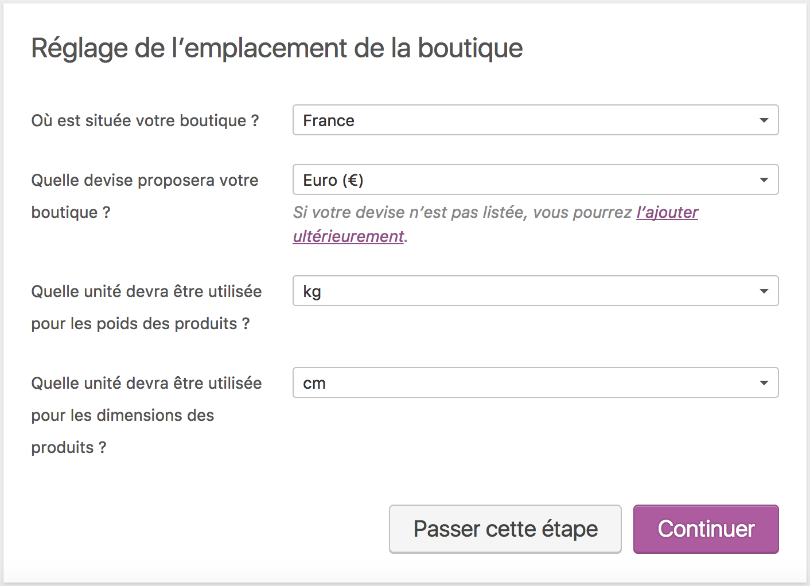

### Activer les taxes et la livraison

Selon l'emplacement et la nature des produits à vendre via WooCommerce vous pouvez activer la notion de taxes. Dans le cas d'un site Français il faudra donc prendre en compte les différents taux de TVA.

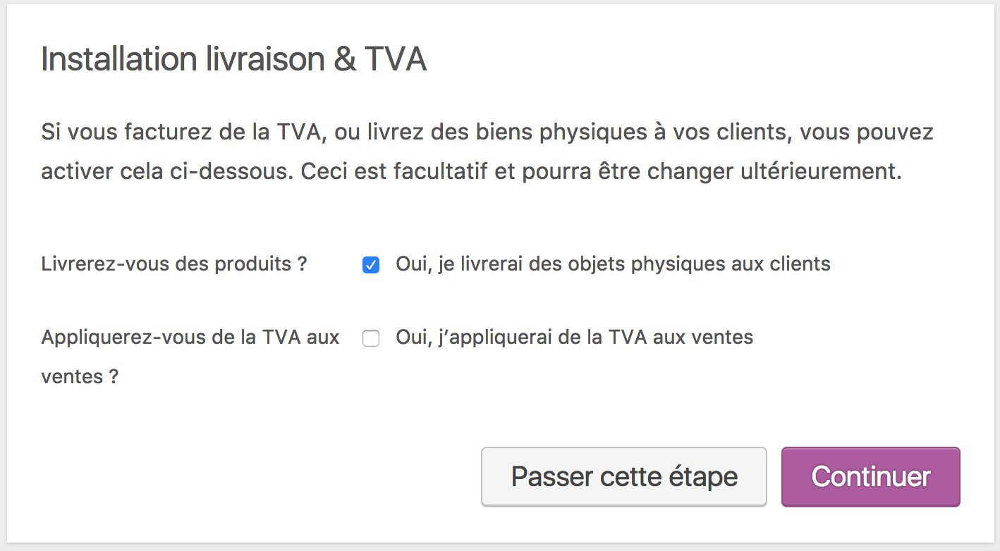

Lorsque vous cliquez sur "Oui, j’appliquerai de la TVA aux ventes", de nouvelles options apparaissent pour vous permettre de visualiser les taux de taxes importés. Vous pourrez en ajouter davantage par la suite:

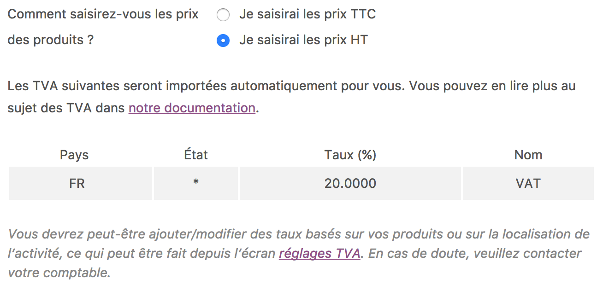

De la même manière, si vous souhaitez livrer des produits physique vous pouvez dès à présent activer l'option correspondante.

### Choisir les modes de paiement

Vous arriverez ensuite aux choix des méthodes de paiement proposés par défaut par WooCommerce. Vous aurez le choix d'activer deux méthodes pour PayPal: PayPal Express et PayPal Standard. Nous y reviendrons plus tard. Pour le moment, il vous suffit simplement de cocher les cases que vous souhaitez pour activer les méthodes de paiement:

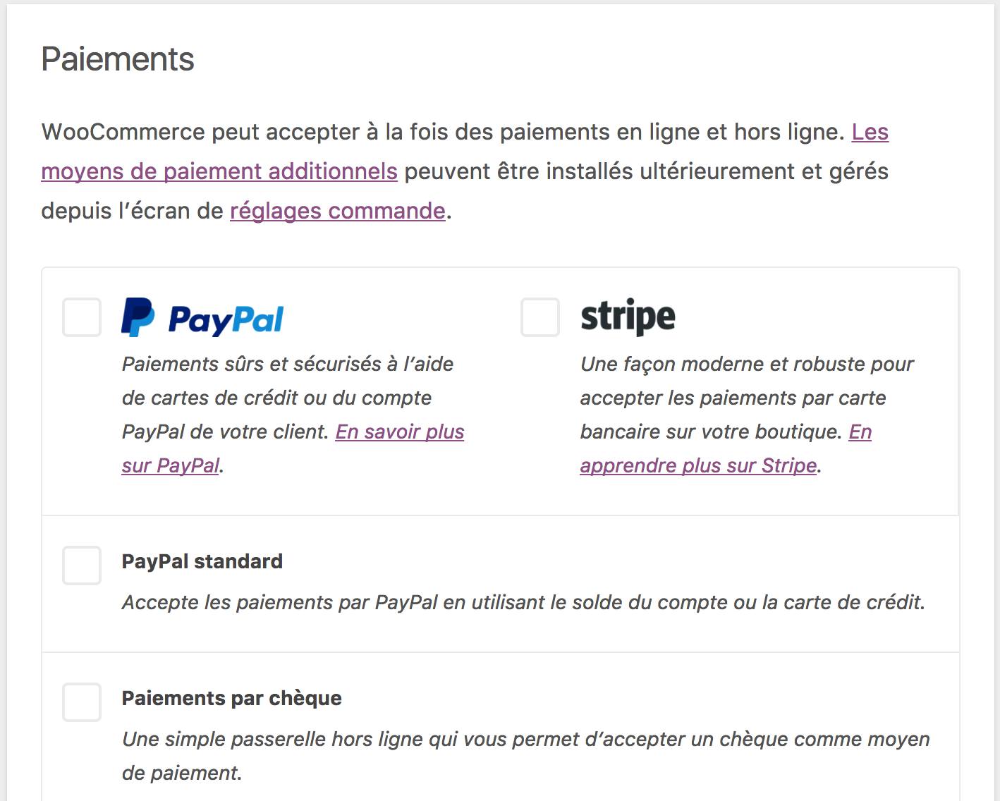

### Votre boutique est prête !

Enfin presque ! En effet le dernier écran de l'assistant de configuration vous propose une dernière option: l'autorisation pour WooCommerce d'utiliser une partie des données de votre site pour créer des statistiques permettant à long terme d'optimiser WooCommerce en fonction de son utilisation. En plus vous obtiendrez un coupon de réduction sur les extensions premium !

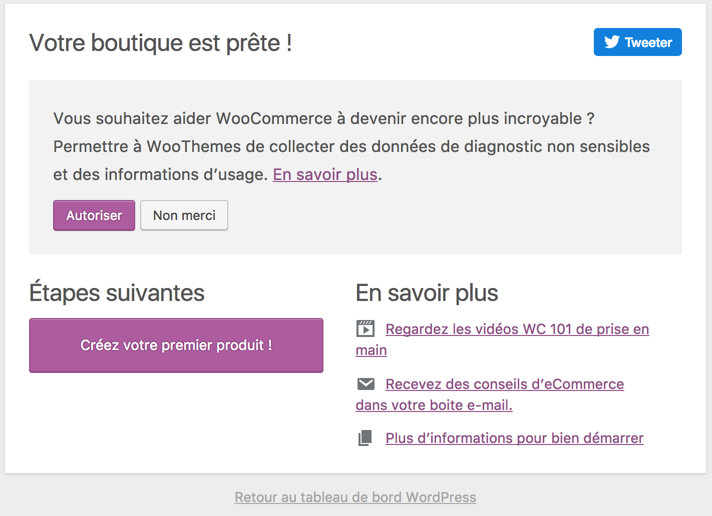
Vous pouvez ensuite revenir à l'administration de WordPress ou créer un premier produit depuis ce même écran.

Profitez-en pour cliquer sur le lien Twitter afin de montrer votre support au projet WooCommerce !

### Mise à jour des données

Notez que si vous ré-installez WooCommerce sur un site ayant déjà fonctionné avec WooCommerce, vous verrez surement ce message vous indiquant de mettre les données à jour. Il s'agit en fait simplement de la mise à jour de la structure des tables de la base de données:

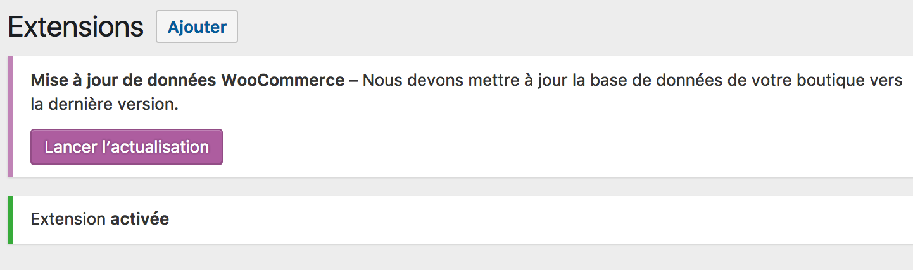

## Utilisez la documentation !

### Près de 3000 pages de documentation !

A partir de maintenant, s'il y a bien un lien que vous devez conservez au chaud c'est bien cette URL:

https://docs.woocommerce.com/

Il s'agit de la documentation officielle de WooCommerce. Elle regorge d'informations sur WooCommerce core, sur les 400 plugins officiels, ainsi que de nombreux bout de code vous permettant d'aller encore plus loin dans l'utilisation de WooCommerce.

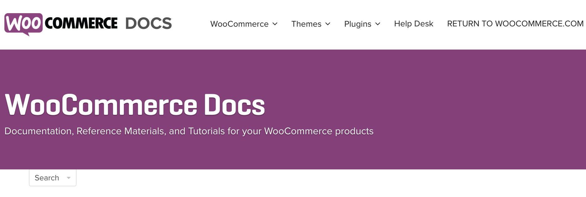

La section réservée à WooCommerce core se trouve ici: https://docs.woocommerce.com/documentation/plugins/woocommerce/. Je vous invite fortement à regarder en particulier la section "Getting started" qui regroupe les thèmes les plus importants.

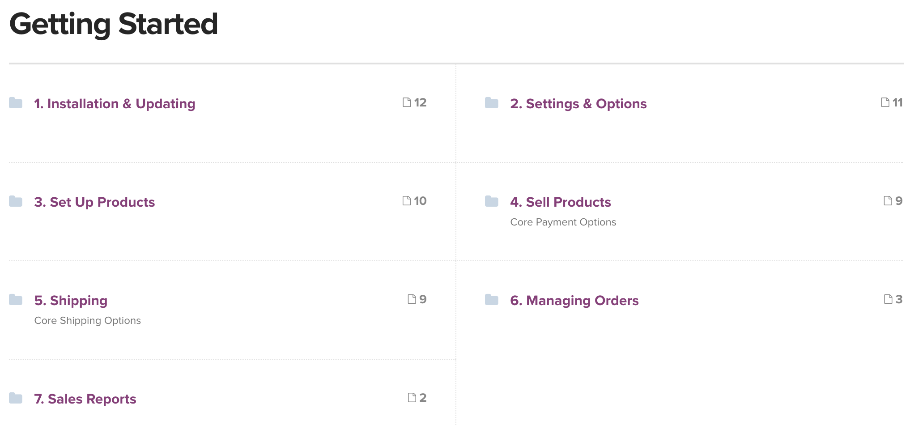

Mais ne vous inquiétez pas si l'Anglais n'est pas votre fort, nous allons aborder dans ce cours la majorité des points de cette section !

## Installer des plugins WooCommerce depuis wordpress.org

WooCommerce propsose une large gamme de plugins (extensions en bon Français), officiels ou non, disponibles sur wordpress.org. Il est en fait très simple d'installer des plugins pour étendre les possibilités de WooCommerce en passant par le site WordPress. Il vous suffit de vous rendre sur la page "Extensions" depuis le menu principal puis cliquez sur "Ajouter". Puis utilisez le moteur de recherche ci-dessous

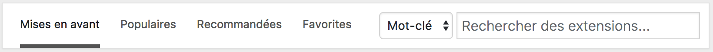

Dans le moteur de recherche tapez simplement le nom d'un service que vous souhaitez associé à WooCommerce, le nom d'un plugin, des mots clés etc...

Notez bien que depuis quelques temps, la convention de nommage des plugins sur WordPress.org a changé et qu'il n'est plus possible de créer des noms commencant par le nom d'un plugin déjà existant. "WooCommerce La Poste" par exemple ne sera pas autorisé alors que "Tracking La Poste for WooCommerce" est accepté. Il vous faudra donc essayé plusieurs requêtes si aucun résultat n'est retourné lors de vos recherche.

Il n'est pas nécessaire de taper sur la touche "Entrée" de votre clavier pour les résultats. Quand vous voyez le plugin à installer, cliquez simplement sur le bouton "Installer".

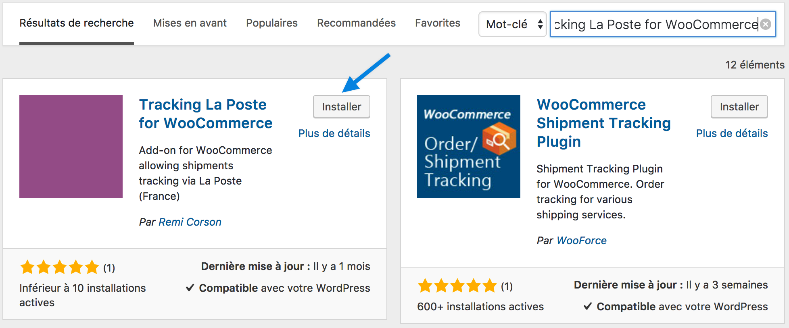

Dès que ce bouton est cliqué, le téléchargement du plugin démarre:

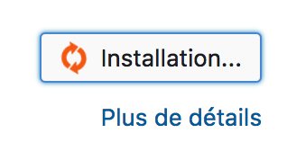

Vous n'avez ensuite qu'à activer le plugin:

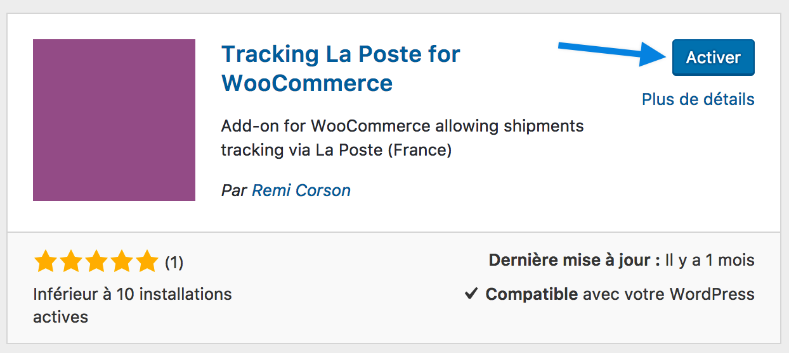

### Les plugins officiels

Automattic et l'entité WooCommerce proposent des extensions officielles (codées par les développeurs de WooCommerce), et la liste est disponible ici: https://profiles.wordpress.org/automattic/#content-plugins

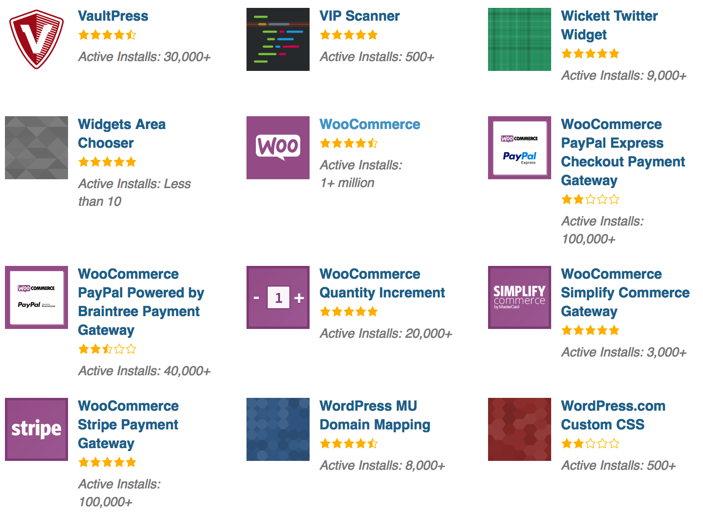

Ces plugins sont certifiés et vous garantissent donc une qualité irréprochable. Sans compter que certains de ces plugins étaient dans le passé des produits premium, disponibles gratuitement. Cela ne veut pas dire que leur qualité à baissé, mais simplement que Automattic à lié des partenariats avec d'autres sociétés comme PayPal, Matsercard et bien d'autres, et que Automattic se crée dorénavant des revenus non plus par la vente de ces extensions mais par des systèmes complexes de partenariat.

Autre avantage: le support. Malgré le fait que ces extensions soient gratuites, vous pouvez bénéficier de support par les équipes d'Automattic. Plutôt cool non ?

Pour finir cette section, je tenais aussi à vous indiquer qu'il est possible de récupérer certains des plugins officiels depuis la page "Mon Compte" sur http://woocommerce.com.

## Installer des plugins officiels depuis woocommerce.com

## Créer les pages de la boutique

## Le System Status et les outils disponibles à tout moment
